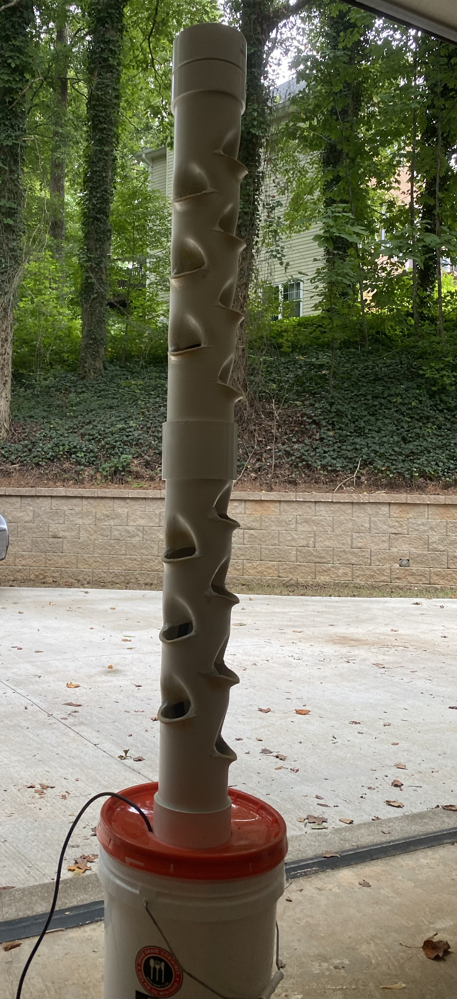

## Hydroponics Email Bot

This is a Python bot that runs on my Raspberry Pi, sending me daily update emails on the water's pH level measured in my DIY hydroponics tower. My code is hydroponicsEmailBot.py, while grove_ph_sensor.py is code provided by the manufacturer.

## Additional Information

* Designed my own hydroponics tower over the summer to grow leafy greens, such as lettuce, kale, and spinach.
* Constructed out of PVC, and I used a heat gun to bend and create the holes the plant pots sit in.
* Uses a 5 gallon bucket resoivor, which pumps up the tower and rains down nutrient-rich water onto the plant's roots.
* Implements the GrovePi add-on & Grove pH sensor with my Raspberry Pi to recieve data and send me update emails daily.

